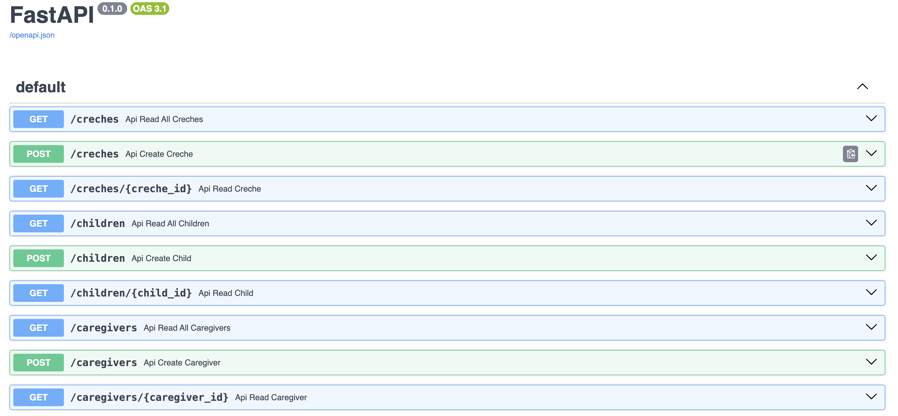

# creche-api

## Table of Contents
- [Introduction](#introduction)
- [Dependencies](#dependencies)
- [Architecture](#architecture)
- [API Endpoints](#api-endpoints)
  - [Parents](#parents)
  - [Children](#children)
  - [Caregivers](#caregivers)
  - [Enrollments](#enrollments)
  - [Creches](#creches)
- [Running the Application](#running-the-application)
- [Accessing the API Documentation](#accessing-the-api-documentation)
- [TODO](#todo)

## Introduction

This project is a REST API for managing operations related to creches, children, caregivers, and enrollments. The API allows for creating, reading, updating, and deleting records in a database.



## Dependencies

Make sure to install the following dependencies:

- FastAPI
- Uvicorn
- SQLAlchemy

You can install these dependencies using pip:

```bash
pip install "fastapi[standard]" uvicorn sqlalchemy
```

## Architecture

The API is organized into several layers:

- **Lower Level: Database**  
  The database stores all information related to crèches, children, caregivers, and enrollments.

- **Operations on Database**  
  This layer contains the business logic for interacting with the database, including creating, reading, updating, and deleting records.

- **API Router Layer**  
  This layer allows us to choose which type of operations to perform based on the HTTP request. It manages the routes and endpoints of the API.

## API Endpoints

### Parents

- **Get All Parents**
  ```bash
  curl -X GET "http://localhost:8000/parents"
  ```

- **Create a Parent**
  ```bash
  curl -X POST "http://localhost:8000/parents" -H "Content-Type: application/json" -d '{"first_name": "Jane", "last_name": "Doe", "email_address": "jane.doe@example.com", "phone_number": "+123456789"}'
  ```

- **Get a Parent by ID**
  ```bash
  curl -X GET "http://localhost:8000/parents/1"
  ```

- **Update a Parent**
  ```bash
  curl -X PUT "http://localhost:8000/parents/1" -H "Content-Type: application/json" -d '{"first_name": "Jane", "last_name": "Smith", "email_address": "jane.smith@example.com", "phone_number": "+987654321"}'
  ```

- **Delete a Parent by ID**
  ```bash
  curl -X DELETE "http://localhost:8000/parents/1"
  ```

- **Get Children of a Parent**
  ```bash
  curl -X GET "http://localhost:8000/parents/1/children"
  ```

- **Add a Child to a Parent**
  ```bash
  curl -X POST "http://localhost:8000/parents/1/children" -H "Content-Type: application/json" -d '{"child_id": 1}'
  ```

- **Remove a Child from a Parent**
  ```bash
  curl -X DELETE "http://localhost:8000/parents/1/children/1"
  ```

### Children

- **Get All Children**
  ```bash
  curl -X GET "http://localhost:8000/children"
  ```

- **Create a Child**
  ```bash
  curl -X POST "http://localhost:8000/children" -H "Content-Type: application/json" -d '{"first_name": "John", "last_name": "Doe", "date_of_birth": "2020-01-01", "parent_id": 1}'
  ```

- **Get a Child by ID**
  ```bash
  curl -X GET "http://localhost:8000/children/1"
  ```

### Caregivers

- **Get All Caregivers**
  ```bash
  curl -X GET "http://localhost:8000/caregivers"
  ```

- **Create a Caregiver**
  ```bash
  curl -X POST "http://localhost:8000/caregivers" -H "Content-Type: application/json" -d '{"first_name": "Jane", "last_name": "Doe", "qualifications": "Bachelor Degree in Early Childhood Education", "years_of_experience": 5, "caregiver_email_address": "jane.doe@example.com", "caregiver_phone_number": "+123456789"}'
  ```

- **Get a Caregiver by ID**
  ```bash
  curl -X GET "http://localhost:8000/caregivers/1"
  ```

### Enrollments

- **Get All Enrollments**
  ```bash
  curl -X GET "http://localhost:8000/enrollments"
  ```

- **Create an Enrollment**
  ```bash
  curl -X POST "http://localhost:8000/enrollments" -H "Content-Type: application/json" -d '{"start_date": "2024-01-01", "end_date": "2024-01-05", "child_id": 1, "caregiver_id": 1, "creche_id": 1, "parent_id": 1, "price": 100}'
  ```

- **Get an Enrollment by ID**
  ```bash
  curl -X GET "http://localhost:8000/enrollments/1"
  ```

- **Delete an Enrollment by ID**
  ```bash
  curl -X DELETE "http://localhost:8000/enrollments/1"
  ```

- **Get Enrollments by Creche and Price**
  ```bash
  curl -X GET "http://localhost:8000/enrollments/creche/1/price/100"
  ```

### Creches

- **Get All Creches**
  ```bash
  curl -X GET "http://localhost:8000/creches"
  ```

- **Create a Creche**
  ```bash
  curl -X POST "http://localhost:8000/creches" -H "Content-Type: application/json" -d '{"name": "Creche A", "address": "123 Rue Exemple", "capacity": 30}'
  ```

- **Get a Creche by ID**
  ```bash
  curl -X GET "http://localhost:8000/creches/1"
  ```
## Running the Application

To run the FastAPI application, use the following command:

```bash
uvicorn main:app --reload
```
- The `--reload` option allows the server to automatically reload when you make changes to the code.

## Accessing the API Documentation

You can access the interactive API documentation provided by FastAPI by navigating to the following URL in your web browser:

```
http://127.0.0.1:8000/docs
```

## TODO

- [ ] **Implement Authentication and Authorization**  
  Add user authentication and authorization to secure the API endpoints.

- [ ] **Add Unit Tests**  
  Write unit tests for all API endpoints and database operations to ensure code reliability and facilitate future changes.

- [ ] **Frontend Integration**  
  Develop a frontend application that interacts with the API to provide a user-friendly interface for managing crèches, children, caregivers, and enrollments.

- [ ] **Containerization**  
  Containerizing the application using Docker for easier deployment and scalability.

